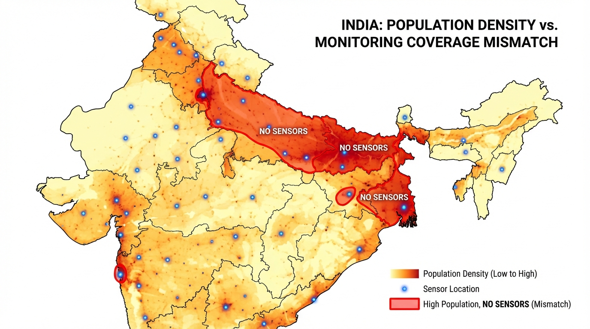
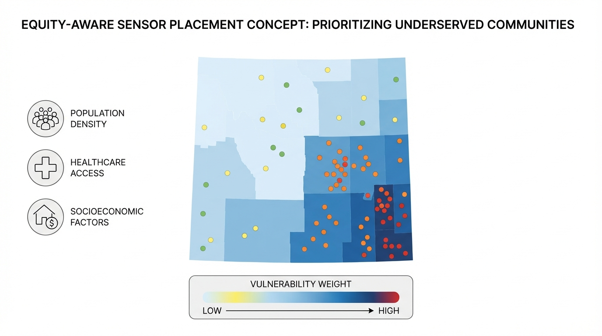
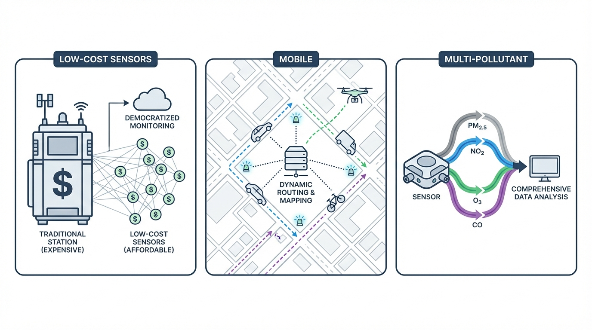

<!-- _class: lead -->
<!-- _paginate: false -->

# Scalable Air-Quality Sensor Placement

**Gradient-Based Mutual Information Maximization**

Zeel B Patel, Vinayak Rana, Nipun Batra
IIT Gandhinagar

AAAI 2026 · AI for Social Impact

---

# Air Pollution: A Global Health Crisis

- **7 million** premature deaths annually (WHO)
- More than malaria, HIV, and road accidents **combined**
- **91%** of deaths in low/middle-income countries

---

# Current Air Quality Monitoring in India

**~600** CPCB stations for **1.4 billion** people

---

# Problem 1: Coverage Only in Urban Areas

Sensors clustered in **Delhi, Mumbai, Chennai, Bangalore, Kolkata**

Rural and semi-urban India remains **invisible**

---

# Problem 2: Vast Population Exposed Without Data

**Hundreds of millions** live in unmonitored regions

No data → No policy → No protection

---

# Problem 3: India Lags Behind

| Country | Stations | People/Station | Stations/1000 km² |
|---------|----------:|--------------:|-----------------:|
| USA | 4,800 | 69K | 0.49 |
| China | 5,000 | 280K | 0.52 |
| Germany | 500 | 166K | 1.40 |
| UK | 300 | 223K | 1.23 |
| **India** | **611** | **2,290K** | **0.19** |

India: **33x worse** people-coverage than USA, **7x lower** area density than Germany

---

# The Core Question

Given a **limited budget** of $k$ new sensors:

**Where should we place them?**

> Goal: Maximize information about the **entire** region

---

# Problem Formulation

$X_c$ — Existing sensors

$X_{\text{pool}}$ — Candidate locations ($n$ points)

$X_t$ — Target region to predict

$k$ — Budget for new sensors

**Goal:** Select $k$ from $X_{\text{pool}}$ to maximize info about $X_t$

---

# Optimal Sensor Placement (OSP)

| | |
|:--|:--|
| **1. Surrogate Model** — Predicts values + uncertainty; must be differentiable |  |
| **2. Acquisition Function** — Scores candidates; guides placement |  |

---

# Acquisition 1: Random

> Pick $k$ locations **uniformly at random** from candidates

$$\underbrace{\color{#00a651}{X_{\text{new}}}}_{\text{selected }k\text{ locations}} \sim \text{Uniform}\Big(\underbrace{\color{#00a651}{X_{\text{pool}}}}_{\text{all }n\text{ candidates}}\Big)$$

**In plain English:**

*"Close your eyes and point at the map $k$ times"*

- No optimization — pure luck
- Ignores data completely
- **Baseline** for comparison

---

# Acquisition 2: Maximum Variance (MaxVar)

> **Greedily** pick the location with **highest uncertainty**

$$\underbrace{\color{#00a651}{x^*}}_{\text{best location}} = \arg\max_{x \,\in\, \color{#00a651}{X_{\text{pool}}}} \underbrace{\text{Var}(\color{#4a90d9}{y} \mid X_c, Y_c, x)}_{\text{how uncertain is prediction at }x\text{?}}$$

**In plain English:**

*"Where are we most uncertain? Put a sensor there."*

Repeat $k$ times, each time adding the selected sensor to context.

| Pros | Cons |
|:-----|:-----|
| Fast: $O(k)$ | Selects **independently** |
| Intuitive | Ignores **interactions** |
| | Tends to **cluster** |

---

# Acquisition 3: Mutual Information (MI)

> Select sensors that **maximize information** about the entire target region

$$I(\color{#4a90d9}{Y_t}; Y_{\text{new}} \mid X_c, Y_c) = \underbrace{H(\color{#4a90d9}{Y_t} \mid X_c, Y_c)}_{\text{uncertainty BEFORE}} - \underbrace{H(\color{#4a90d9}{Y_t} \mid X_c, Y_c, Y_{\text{new}})}_{\text{uncertainty AFTER}}$$

**In plain English:**

*"How much does knowing $Y_{\text{new}}$ reduce our uncertainty about $\color{#4a90d9}{Y_t}$?"*

- First term: **fixed** (current uncertainty)
- Second term: **minimize** (remaining uncertainty after placing sensors)

$$\therefore \quad \max_{\color{#00a651}{X_{\text{new}}}} I \;\equiv\; \min_{\color{#00a651}{X_{\text{new}}}} H(\color{#4a90d9}{Y_t} \mid \text{all data})$$

---

# MI: Why It's Better (But Slower)

**MI considers sensor interactions:**

| | MaxVar | MI |
|:--|:------:|:--:|
| Selection | **Independent** | **Joint** |
| Redundancy | Ignores | Penalizes |
| Coverage | Clusters | Spreads |

**But:** Must evaluate every candidate at each step

$$\text{Complexity: } O(n \cdot k) \quad \text{where } n = |X_{\text{pool}}|$$

> For India grid ($n \approx 20,000$) — **infeasible!**

---

<!-- _class: lead -->

# The Challenge

We want **MI quality** but with **MaxVar speed**

Can we get both?

---

# Key Idea: GD-MI

> **Don't search** over discrete candidates — **optimize** coordinates directly!

| Discrete (Greedy MI) | Continuous (GD-MI) |
|:---:|:---:|
|  |  |
| Search over $n$ candidates | Gradient descent on coordinates |
| $O(n \cdot k)$ | $O(I)$ iterations |

**Runtime independent of grid resolution!**

---

# GD-MI: How It Works

$$\min_{\color{#00a651}{X_{\text{new}}}} \; \mathbb{E}_{x_t \in \color{#4a90d9}{X_t}}\Big[\text{Var}(\color{#4a90d9}{y_t} \mid X_c, Y_c, \color{#00a651}{X_{\text{new}}}, \hat{Y}_{\text{new}})\Big]$$

**In plain English:**

*"Find sensor positions that minimize remaining uncertainty over the target region"*

| Step | What happens |
|:----:|:-------------|
| 1 | Initialize $X_{\text{new}}$ randomly in valid region |
| 2 | Predict $\hat{Y}_{\text{new}}$ at proposed locations |
| 3 | Compute uncertainty over $X_t$ (target) |
| 4 | Backpropagate → update $X_{\text{new}}$ |
| 5 | Repeat until convergence |

---

# Why GD-MI Works

| Property | Greedy MI | GD-MI |
|:---------|:---------:|:-----:|
| Considers interactions | Yes | Yes |
| Runtime | $O(n \cdot k)$ | $O(I)$ |
| Scales to India | No | **Yes** |
| Optimization | Discrete search | Continuous |

**Key insight:** Sensor coordinates are just numbers — we can differentiate through them!

---

# Surrogate Model: Why Neural Processes?

GD-MI needs a model that provides:

| Requirement | Why? |
|:------------|:-----|
| **Predictions** | To impute values at proposed locations |
| **Calibrated uncertainty** | To compute information gain |
| **Differentiable** | To backpropagate through |
| **Fast inference** | To iterate quickly |

> **TNP-D** (Transformer Neural Process) satisfies all!

---

# Surrogate Model: TNP-D

**Transformer Neural Process**

- Predicts PM$_{2.5}$ **and** uncertainty
- Fully differentiable
- Fast parallel inference

| Model | RMSE ↓ | NLL ↓ |
|-------|-------:|------:|
| GP | 5.16 | -0.19 |
| ConvGNP | 5.31 | -0.30 |
| **TNP-D** | **4.90** | **-0.44** |

---

<!-- _class: lead -->

# Experiments

Does GD-MI actually work?

---

# Experiment 1: Regional Validation (Madhya Pradesh)

> Where Greedy MI is computationally feasible

**Results (k=9 sensors):**

| Method | RMSE ↓ |
|:-------|-------:|
| Random | 7.2 |
| MaxVar | 6.3 |
| **GD-MI (ours)** | **5.8** |
| MI (gold) | 5.6 |

GD-MI closes **83%** of gap!

---

# Experiment 2: India-Scale

> Greedy MI is infeasible here ($n \approx 20,000$)

**Key findings:**

- GD-MI **4% better** than MaxVar
- Gap **grows** with more sensors
- Consistent across budgets

---

# Why Does GD-MI Win? Qualitative Analysis

**MaxVar (blue)**
- Clusters at boundaries
- Redundant sensors
- Ignores existing

**GD-MI (red)**
- Spreads for coverage
- Diverse placements
- Complements network

---

# Impact: Same Budget, Better Outcomes

- **Better placement** (GD-MI)
- → **Better models** (lower RMSE)
- → **Better policy** (accurate pollution maps)
- → **Better health** (targeted interventions)

> **4% RMSE improvement** = meaningful policy impact at national scale

---

# Current Limitation: Equity

We minimize **average** variance

But pollution burden is **not uniform**

> Optimizing for uncertainty ≠ Optimizing for fairness

---

# Future: Equity-Aware Placement

$$\mathcal{L}_{\text{fair}} = \mathbb{E}\Big[w(\color{#4a90d9}{x_t}) \cdot \text{Var}(\color{#4a90d9}{y_t})\Big]$$

Weight $w(\cdot)$ by:
- Population density
- Vulnerability index
- Healthcare access

> Same framework — different objective!

---

# Future: Beyond Static Sensors

| Low-Cost Sensors | Mobile | Multi-pollutant |
|:----------------:|:------:|:---------------:|
| Dense affordable networks | Dynamic routing | Joint optimization |

---

# Sustainability Lab @ IITGN

**AI for environmental and health monitoring**

- Air quality sensing (this work)
- Energy disaggregation (NILM)
- Health sensing from wearables
- Satellite imagery for sustainability

https://sustainability-lab.github.io

---

# Main Takeaways

1. **MI-quality** placement at continental scale
2. **Continuous optimization** beats greedy methods
3. **Runtime independent** of grid resolution
4. **Deployable AI** for real-world policy impact

---

<!-- _class: lead -->
<!-- _paginate: false -->

# Thank You

**Code:** github.com/sustainability-lab/gdmi-aqs

**Contact:** {patel_zeel, vinayak.rana, nipun.batra}@iitgn.ac.in

---

<!-- _paginate: false -->

# Backup Slides

---

# Dataset: WUSTL PM₂.₅

- **Source:** Washington University in St. Louis
- **Resolution:** 0.1° × 0.1° (~11 km)
- **Period:** 1998-2018 (21 years monthly)
- **Split:** Train 98-08 | Val 09-10 | Test 11-18

---

# Full Model Benchmark

| Model | NLL ↓ | RMSE ↓ |
|-------|:-----:|:------:|
| CNP | 0.48 | 11.46 |
| Random Forest | -0.11 | 6.55 |
| GP | -0.19 | 5.16 |
| ConvCNP | -0.27 | 5.28 |
| ConvGNP | -0.30 | 5.31 |
| TabPFN | -0.37 | 5.09 |
| **TNP-D** | **-0.44** | **4.90** |

---

# Constraint: Keep Sensors on Land

$$\mathcal{L}_{\text{OOR}} = \sum_i \exp\Big(\text{dist}(\color{#00a651}{x_i}, \text{land}) - \delta\Big) - 1$$

Soft penalty grows exponentially as sensors drift toward ocean

---

# Scalability Analysis

- GD-MI runtime **independent of pool size**
- At 20K candidates: GD-MI is **100× faster** than Greedy MI
- Enables continental-scale optimization

---

# More Results: k = 50

---

# More Results: k = 100

