<!-- _class: lead -->
<!-- _paginate: false -->

# Scalable Sensor Placement for Air Quality via Gradient-Based Optimization of Mutual Information

Zeel B Patel

Vinayak Rana

Nipun Batra

AAAI 2026 · AI for Social Impact Track

---

# Air Pollution: A Global Health Crisis

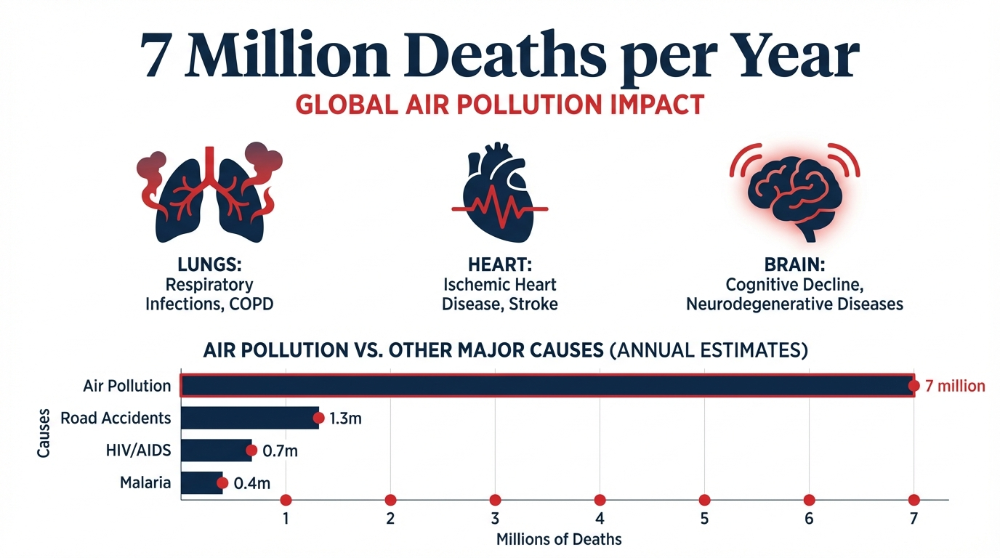

- **7 million** premature deaths annually (WHO)
- More than malaria, HIV, and road accidents **combined**
- **91%** of deaths in low/middle-income countries

---

# Current Air Quality Monitoring in India

| Metric | Value |
|:-------|------:|
| CPCB stations | ~600 |
| Population | 1.4 billion |
| People per station | **2.3 million** |
| Area per station | **5,400 km²** |

> **Takeaway:** Severely under-monitored for a country of this size and pollution levels

---

# The Coverage Gap

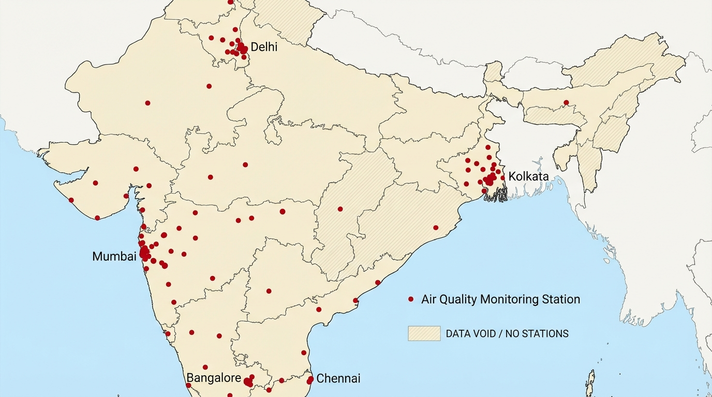

**Urban-only coverage**
- Sensors in Delhi, Mumbai, Chennai, Bangalore, Kolkata
- Rural India remains **invisible**

**Hundreds of millions** unmonitored

No data → No policy → No protection

---

# Global Comparison: Room for Growth

| Country | Stations ↑ | People/Station ↓ | Stations/1000 km² ↑ |
|---------|----------:|--------------:|-----------------:|
| USA | 4,800 | 69K | 0.49 |
| China | 5,000 | 280K | 0.52 |
| Germany | 500 | 166K | 1.40 |
| UK | 300 | 223K | 1.23 |
| **India** | **611** | **2,290K** | **0.19** |

India has **33× more people per station** than USA — significant opportunity for expansion

---

# Why Not Just Add More Sensors?

**Full CPCB CAAQMS** (BAM + gases + shelter): **₹2-3 crore+** per station

| | Cost (₹) | Cost ($) |
|:--|--:|--:|
| 1 station | ₹2-3 crore | $250-350K |
| 100 stations | ₹200-300 crore | $25-35M |
| 1,000 stations | ₹2,000-3,000 crore | $250-350M |

Current CPCB network: ~600 stations

> **Smart placement is critical** — every sensor must maximize value!

---

# The Core Question

Given a **limited budget** of $k$ new sensors:

**Where should we place them?**

> Goal: Maximize information about the **entire** region

---

# Problem Formulation

$X_c$ — Existing sensors

$X_{\text{pool}}$ — Candidate locations ($n$ points)

$X_t$ — Target region to predict

$k$ — Budget for new sensors

**Goal:** Select $k$ from $X_{\text{pool}}$ to maximize info about $X_t$

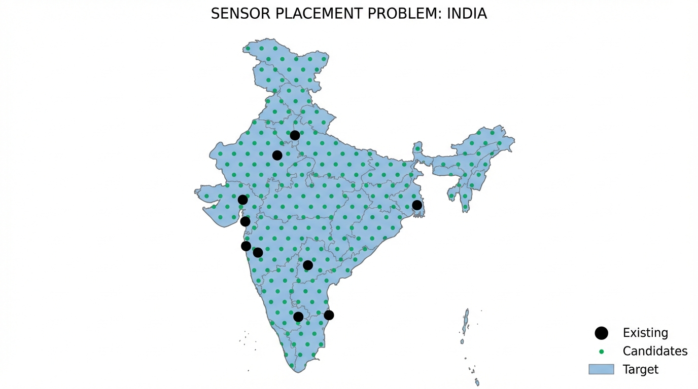

---

# Optimal Sensor Placement (OSP)

| | |
|:--|:--|
| **1. Surrogate Model** — Predicts values + uncertainty; must be differentiable | 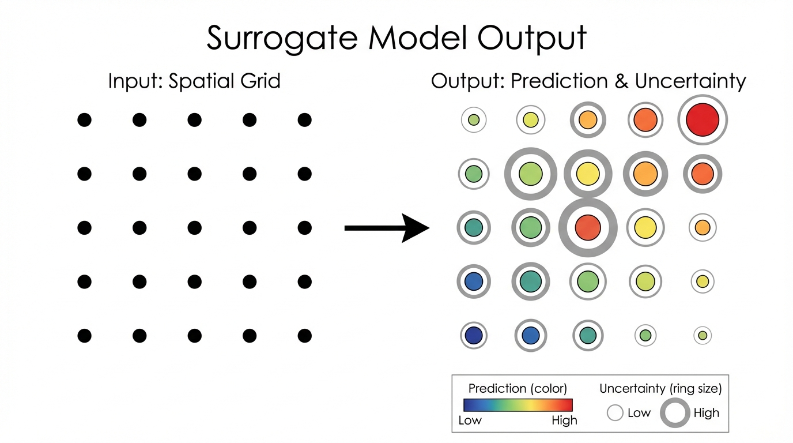 |
| **2. Acquisition Function** — Scores candidates; guides placement | 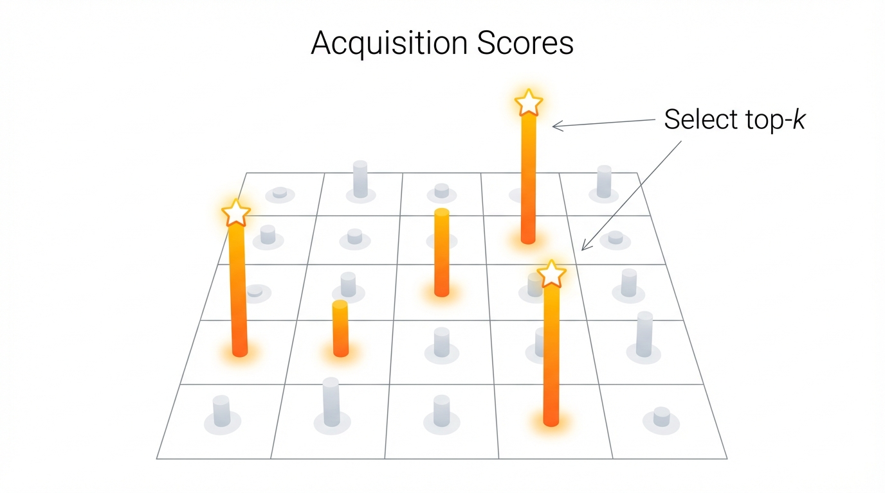 |

---

# Acquisition 1: Random

> Pick $k$ locations **uniformly at random** from candidates

$$\underbrace{\color{#00a651}{X_{\text{new}}}}_{\text{selected }k\text{ locations}} \sim \text{Uniform}\Big(\underbrace{\color{#00a651}{X_{\text{pool}}}}_{\text{all }n\text{ candidates}}\Big)$$

**In plain English:**

*"Close your eyes and point at the map $k$ times"*

- No optimization — pure luck
- Ignores data completely
- **Baseline** for comparison

---

# Acquisition 2: Maximum Variance (MaxVar)

> **Greedily** pick the location with **highest uncertainty**

$$\underbrace{\color{#00a651}{x^*}}_{\text{best location}} = \arg\max_{x \,\in\, \color{#00a651}{X_{\text{pool}}}} \underbrace{\text{Var}(\color{#4a90d9}{y} \mid X_c, Y_c, x)}_{\text{how uncertain is prediction at }x\text{?}}$$

**In plain English:**

*"Where are we most uncertain? Put a sensor there."*

Repeat $k$ times, each time adding the selected sensor to context.

**Pros:** Fast $O(k)$, intuitive

**Cons:** Doesn't maximize information gain with minimum sensors

---

# The MI Objective: What We Want to Maximize

> **Mutual Information:** How much does knowing $Y_{\text{new}}$ reduce uncertainty about $Y_t$?

$$I(\color{#4a90d9}{Y_t}; Y_{\text{new}} \mid X_c, Y_c) = \underbrace{H(\color{#4a90d9}{Y_t} \mid X_c, Y_c)}_{\text{uncertainty BEFORE}} - \underbrace{H(\color{#4a90d9}{Y_t} \mid X_c, Y_c, Y_{\text{new}})}_{\text{uncertainty AFTER}}$$

**Reading this:** *"Given existing sensors $(X_c, Y_c)$, how much does adding new sensors reduce our uncertainty about the target region?"*

$$\max_{\color{#00a651}{X_{\text{new}}}} I \;\equiv\; \min_{\color{#00a651}{X_{\text{new}}}} H(\color{#4a90d9}{Y_t} \mid \text{all data})$$

---

# MI vs MaxVar: What's the Difference?

**For Gaussian outputs** (GP/Neural Process): $H \propto \log \sigma^2$ → both use variance

| | MaxVar | MI |
|:--|:------:|:--:|
| Optimizes for | Single point | Entire target region |
| Variance | **at candidate** | **over target region** |

- MaxVar: *"where am I uncertain?"*
- MI: *"what reduces uncertainty everywhere?"*

**Problem:** Exact MI requires searching $\binom{n}{k}$ subsets — combinatorially explosive!

---

# Acquisition 3: Greedy MI (Standard Approach)

> Since exact MI is intractable, use **greedy approximation**: select one sensor at a time

$$\color{#00a651}{x^*} = \arg\max_{x \in \color{#00a651}{X_{\text{pool}}}} I(\color{#4a90d9}{Y_t}; y_x \mid X_c, Y_c, \text{selected})$$

**Algorithm:** For each of $k$ rounds, evaluate all $n$ candidates → pick best

**Complexity:** $O(n \cdot k)$ evaluations

| $n$ (candidates) | $k$ (budget) | Evaluations |
|:----------------:|:------------:|:-----------:|
| 1,000 | 50 | 50,000 |
| **20,000** | **100** | **2,000,000** |

> For India ($n \approx 20,000$): **computationally infeasible!**

---

<!-- _class: lead -->

# The Challenge

**Greedy MI** gives best quality but doesn't scale

**MaxVar** scales but gives poor quality

Can we get **both**?

---

# Our Solution: GD-MI

> **Key insight:** Don't search discrete candidates — **optimize coordinates directly!**

| | Greedy MI | GD-MI (Ours) |
|:--|:--:|:--:|
| **Search space** | Discrete ($n$ candidates) | Continuous (coordinates) |
| **Optimization** | Enumerate all | Gradient descent |
| **Complexity** | $O(n \cdot k)$ | $O(I)$ iterations |
| **Scalability** | ❌ $n > 1000$ | ✓ Any $n$ |

Greedy MI: Search grid

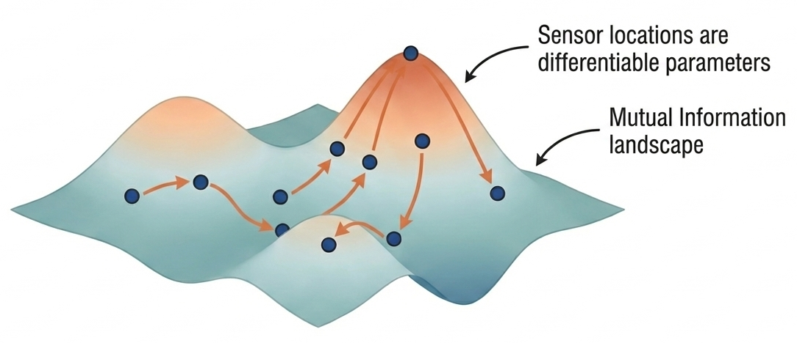
GD-MI: Follow gradient

---

# GD-MI: How It Works

**What we optimize:** $k$ sensor locations, each a (lat, lon) pair

$$\color{#00a651}{X_{\text{new}}} = \{(lat_1, lon_1), \ldots, (lat_k, lon_k)\}$$

**Objective:** Minimize average variance over target region

$$\mathcal{L} = \frac{1}{|X_t|} \sum_{x_t \in \color{#4a90d9}{X_t}} \sigma^2\Big(x_t \mid X_c, Y_c, \color{#00a651}{X_{\text{new}}}, \hat{Y}_{\text{new}}\Big)$$

where $\hat{Y}_{\text{new}} = \mu(X_{\text{new}} \mid X_c, Y_c)$ — predicted values at proposed locations

**Algorithm:** Initialize → Forward (get $\sigma^2$) → Backward ($\nabla_{X_{\text{new}}} \mathcal{L}$) → Update → Repeat

> **Key:** Model is **frozen** — only the $2k$ coordinates are optimized

---

# Surrogate Model: Why Neural Processes?

GD-MI needs a model that provides:

| Requirement | Why? |
|:------------|:-----|
| **Predictions** | To impute values at proposed locations |
| **Calibrated uncertainty** | To compute information gain |
| **Differentiable** | To backpropagate through |
| **Fast inference** | To iterate quickly |

> **TNP-D** (Transformer Neural Process) satisfies all!

---

# Surrogate Model: Transformer Neural Process (TNP-D)

- Predicts PM$_{2.5}$ **and** uncertainty
- Fully differentiable
- Fast parallel inference

| Model | RMSE ↓ | NLL ↓ |
|-------|-------:|------:|
| Gaussian Process | 5.16 | -0.19 |
| Convolutional GNP | 5.31 | -0.30 |
| **Transformer NP** | **4.90** | **-0.44** |

---

<!-- _class: lead -->

# Experiments

Does GD-MI actually work?

---

# Experiment 1: Regional Validation

> **Madhya Pradesh** — a central Indian state (~size of Germany, $n$=308 candidates)

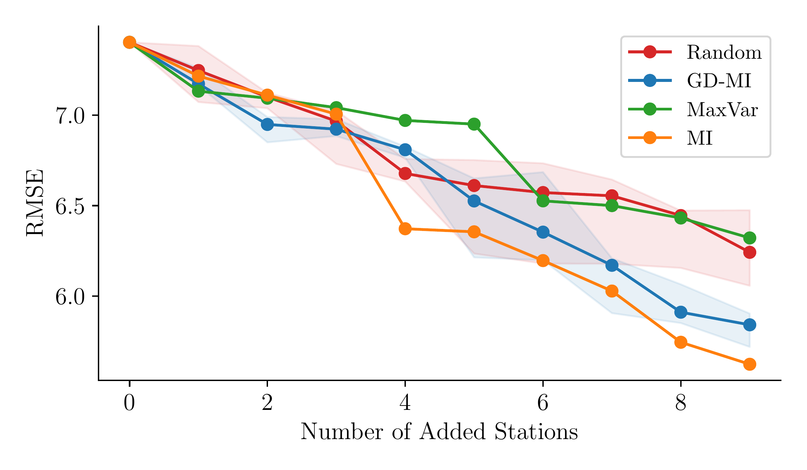

**Results (k=9 sensors):**

| Method | RMSE ↓ |
|:-------|-------:|
| Random | 7.2 |
| MaxVar | 6.3 |
| **GD-MI** | **5.8** |
| Greedy MI | 5.6 |

GD-MI within **0.2 RMSE** of Greedy MI (gold standard)

---

# Experiment 2: India-Scale (The Real Test)

> **Greedy MI infeasible** ($n \approx 20,000$) — GD-MI shines here

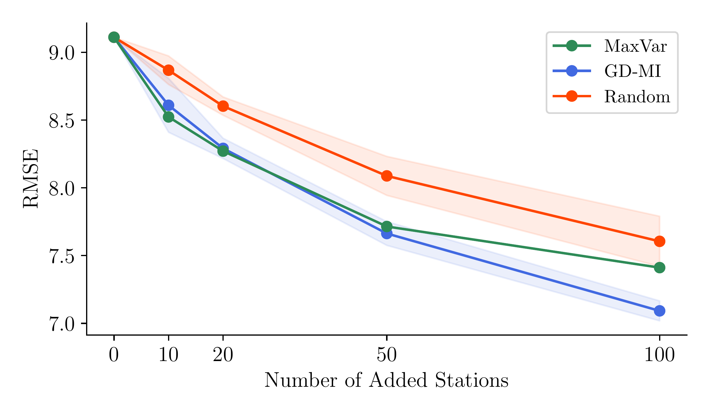

**Key findings:**

- GD-MI **4% better** than MaxVar
- Gap **grows** with more sensors
- Consistent across budgets

---

# Why Does GD-MI Win? Qualitative Analysis

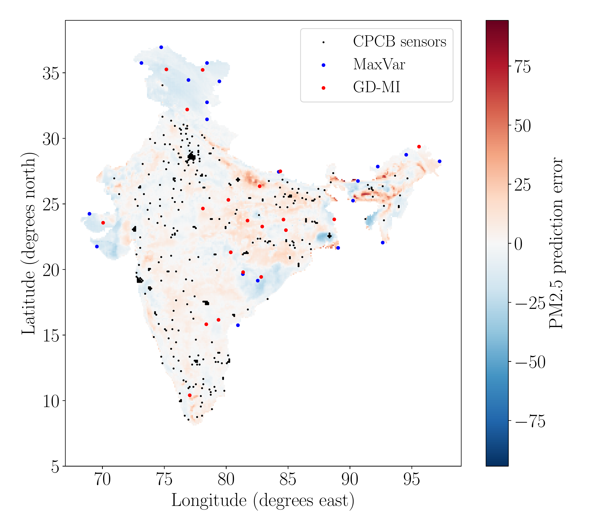

**MaxVar** (blue dots)
- Optimizes for single-point uncertainty
- Doesn't consider target region

**GD-MI** (red dots)
- Optimizes for entire target region
- Maximizes information gain

*MI objective guides placement for maximum coverage*

---

# Scalability: GD-MI vs Greedy MI

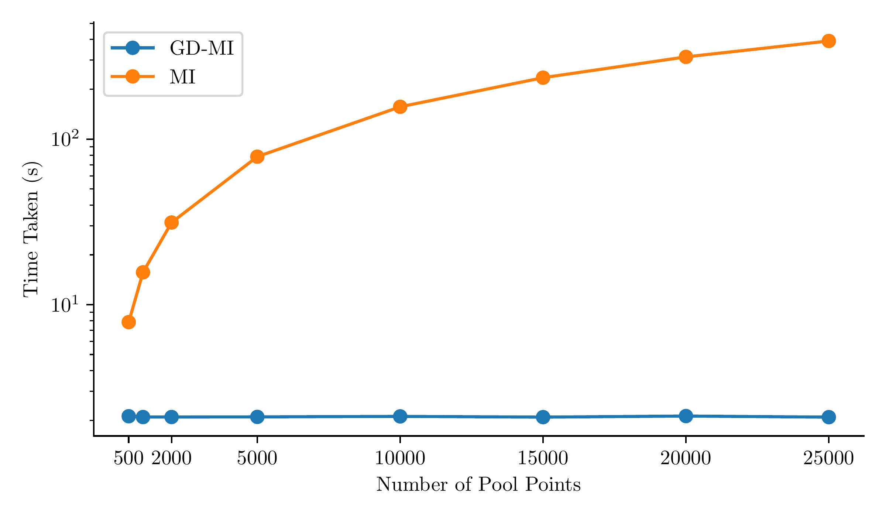

- Greedy MI: **runtime grows** with pool size $n$
- GD-MI: **constant time** regardless of $n$
- At $n = 20,000$: GD-MI is **~100× faster**

---

# Limitations & Future Work

**Current Limitation**

We minimize **average** variance, but pollution burden is **not uniform**

**Equity-Aware Placement:**
$$\mathcal{L}_{\text{fair}} = \mathbb{E}\Big[w(x_t) \cdot \text{Var}(y_t)\Big]$$

Weight by population, pollution, health vulnerability

**Beyond Static Sensors**

- **Low-cost sensors:** Dense affordable networks
- **Mobile sensing:** Dynamic routing optimization
- **Multi-pollutant:** Joint PM₂.₅, NO₂, O₃

Same GD-MI framework, different objectives!

---

<!-- _paginate: false -->

---

# Main Takeaways

1. **GD-MI** = First gradient-based MI maximization for sensor placement

2. **Scalability breakthrough:** $O(I)$ vs $O(n \cdot k)$
   - Enables **continental-scale** optimization

3. **Quality preserved:** Matches Greedy MI where tractable, **4% better** than MaxVar at scale

4. **Real-world ready:** Deployed framework for India air quality monitoring

---

<!-- _class: lead -->
<!-- _paginate: false -->

# Thank You!

Paper

Lab

**Sustainability Lab @ IIT Gandhinagar**

Positions: PhD · Postdoc · RA · Intern

{patel_zeel, vinayak.rana, nipun.batra}@iitgn.ac.in

---

<!-- _paginate: false -->

# Backup Slides

---

# Impact: Same Budget, Better Outcomes

**The cascade effect:**

Better placement (GD-MI)
↓
Better predictions (lower RMSE)
↓
Better pollution maps (policy-ready)
↓
Better health outcomes (targeted interventions)

> **4% RMSE improvement** at national scale = **millions** of people better served

---

# Dataset: WUSTL PM₂.₅

- **Source:** Washington University in St. Louis
- **Resolution:** 0.1° × 0.1° (~11 km)
- **Period:** 1998-2018 (21 years monthly)
- **Split:** Train 98-08 | Val 09-10 | Test 11-18

---

# Full Model Benchmark

| Model | NLL ↓ | RMSE ↓ |
|-------|:-----:|:------:|
| CNP | 0.48 | 11.46 |
| Random Forest | -0.11 | 6.55 |
| GP | -0.19 | 5.16 |
| ConvCNP | -0.27 | 5.28 |
| ConvGNP | -0.30 | 5.31 |
| TabPFN | -0.37 | 5.09 |
| **TNP-D** | **-0.44** | **4.90** |

---

# Constraint: Keep Sensors on Land

$$\mathcal{L}_{\text{OOR}} = \sum_i \exp\Big(\text{dist}(\color{#00a651}{x_i}, \text{land}) - \delta\Big) - 1$$

Soft penalty grows exponentially as sensors drift toward ocean

---

# Scalability Analysis

- GD-MI runtime **independent of pool size**
- At 20K candidates: GD-MI is **100× faster** than Greedy MI
- Enables continental-scale optimization

---

# More Results: k = 50

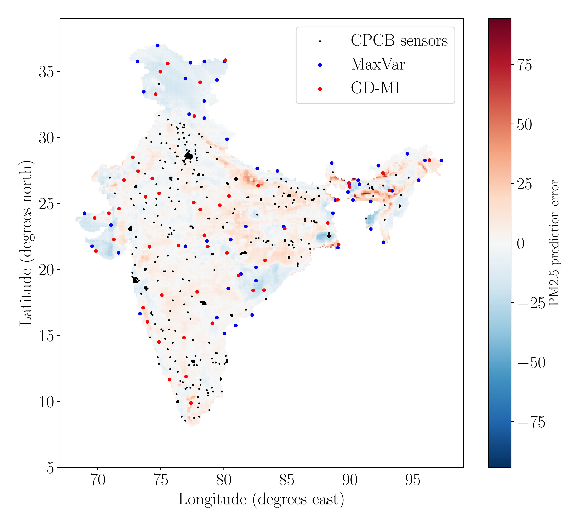

---

# More Results: k = 100

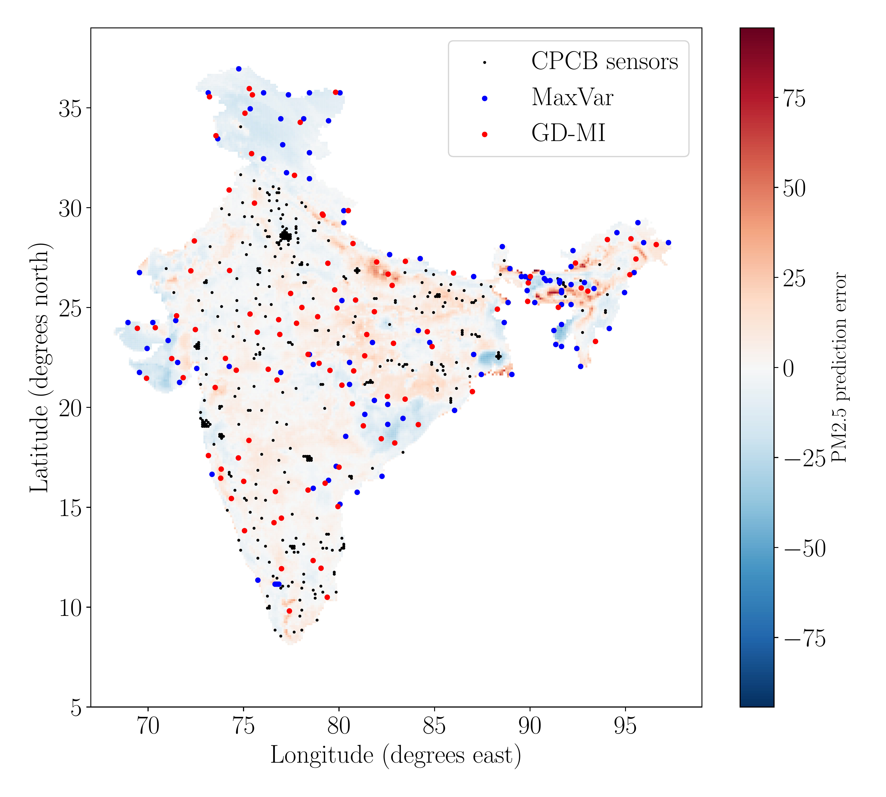
